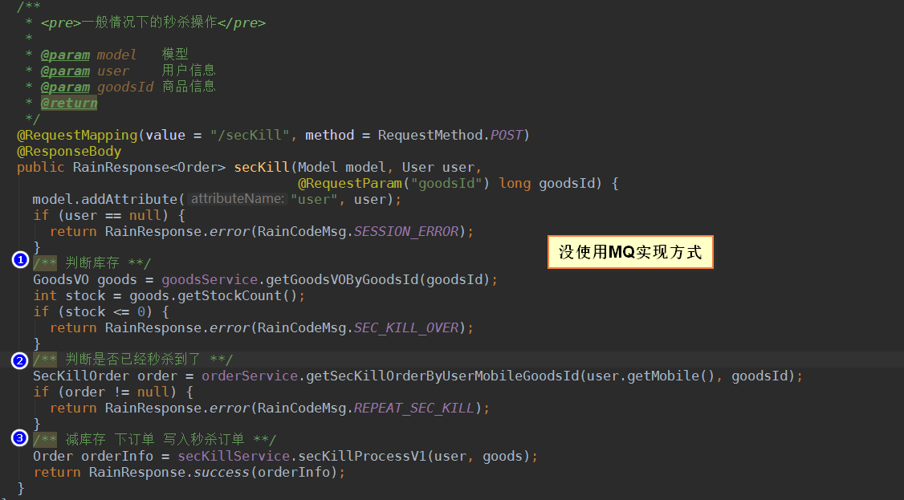
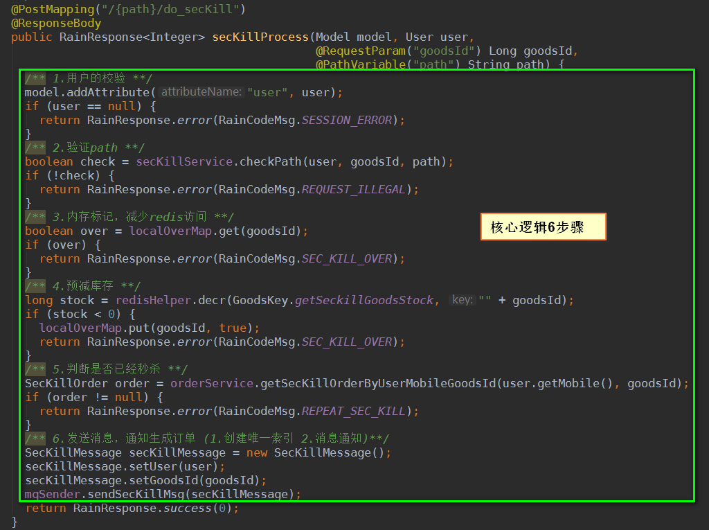
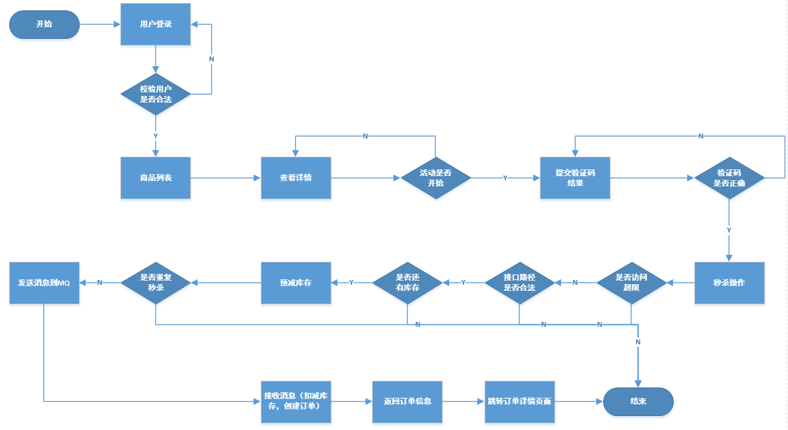

## 电商秒杀活动项目实战

#### 一、概述
* 序言
> 电商秒杀活动应该是一种很常见的场景，对于一个系统，如何做好一个秒杀活动需要综合考虑很多因素。去年（也就是2017年）的时候，项目组
有人做微信端的秒杀活动，由于使用的Salesforce语言作为后端语言，活动一上线的时候，就出现了秒杀太火爆了，库存只有100个，但是有120多个人
秒杀成功了，当时也是没办法，赶紧把活动下线了，进行了后续的修复和客户的补偿。因此这样做出来的秒杀活动，简直是。。。所以这里综合各方面的
因素对秒杀活动进行分析和实践。

* 秒杀的特点
    * 短时间内并发量高
    * 秒杀的商品数量有限
    
* 秒杀活动设计策略
    * 页面缓存
    * 接口设计合理
    * 减少数据库访问
    
* 四原则
    * 缓存（页面缓存，对象缓存，数据缓存）
    * 限流（控制一个用户在一段时间内最大访问次数）
    * 削峰（异步处理）

* 使用技术
    * 缓存：Redis
    * 限流：使用Java自定义注解来控制
    * 防刷：在限流的基础上，再加上以下两种方式：a.隐藏地址 b.使用验证码
    * 消息中间件：RabbitMQ
    * 压测工具：JMeter

### 二、系统实现

### 三、秒杀流程图

### 四、待补充
* Redis/RabbitMQ/JMeter软件的使用

2018-05-19 18:10 完成

